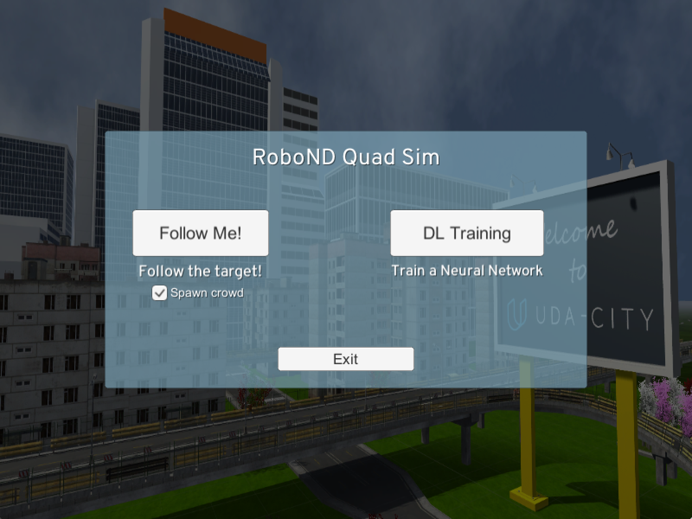
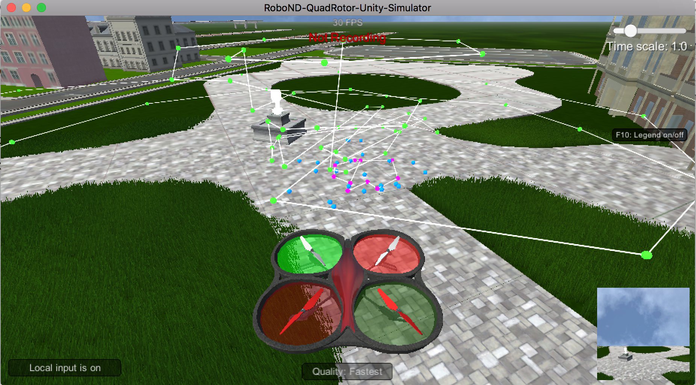
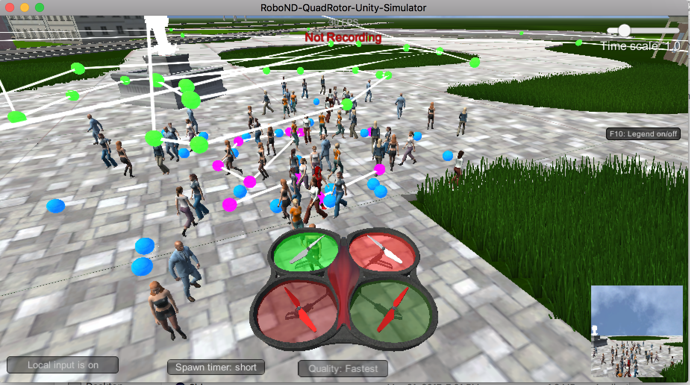
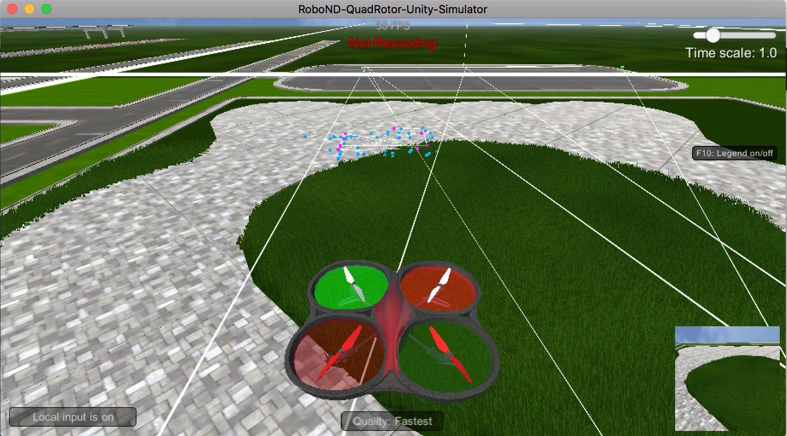
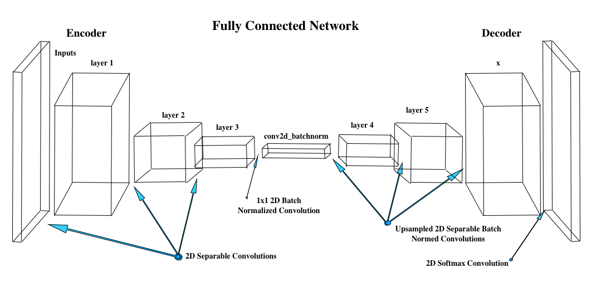
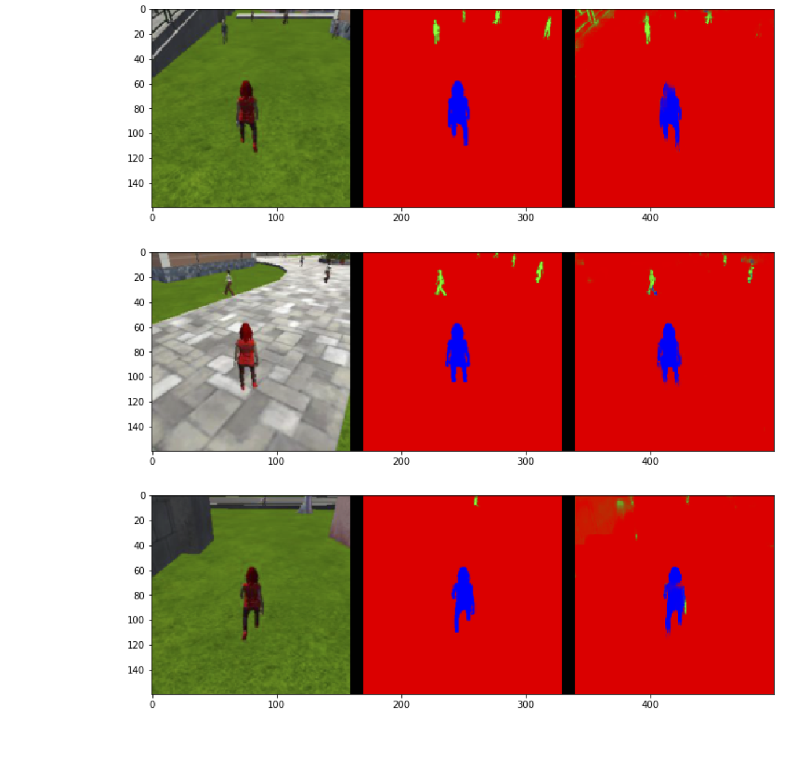
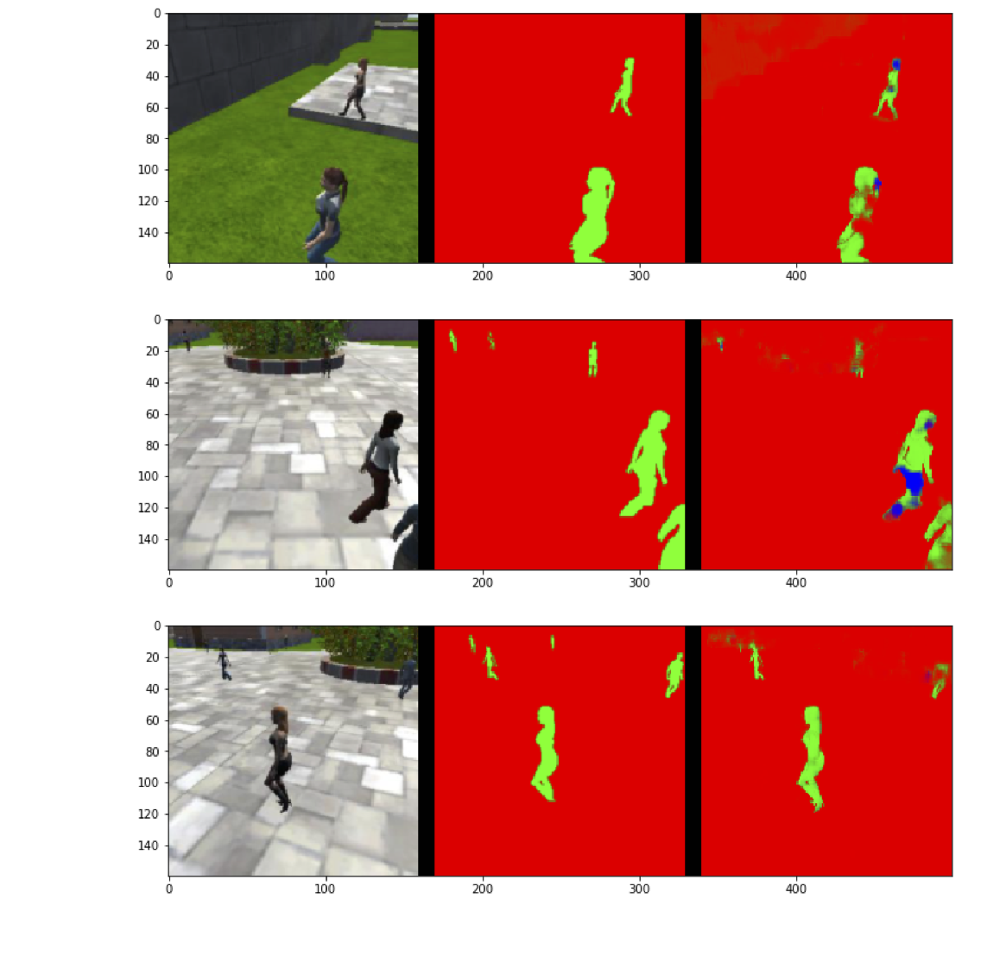
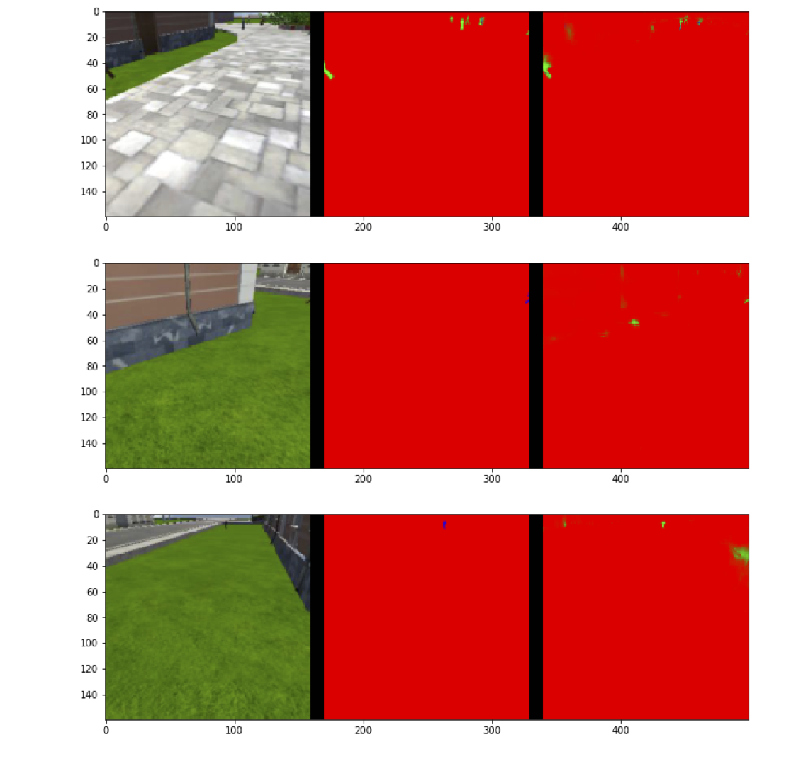

## Deep Learning Project ##

This project implements a fully convolutional Deep Neural Network (DNN) for semantic segmentation. Semantic segmentation  accurately segments to the actual shape of the object unlike bounding boxes. The DNN learns and later identifies and tracks a target in simulation. This target is called the `hero` throughout this documentation. 

In a Fully Connected Layer each perceptron is connected to every perceptron in the previous layer, and each connection has it's own weight. This is a general purpose connection pattern making no assumptions about features in the data. 

A convolutional layer each perceptron is only connected to a few nearby perceptrons in the previous layer, and the same set of weights is used for every perceptron. Convolutional layers are used for image data where the features are local (e.g. a "person" consists of a set of nearby pixels, not spread across the image), and equally likely to occur anywhere in the image. The fewer number of connections and weights make convolutional layers computationally cheaper than Fully Connected Layers.

The name `convolutional` network comes from the fact that the local connection pattern and shared weight scheme can be interpreted as a filter being "convolved" with the input.

This project consists of the following:

* Implemented the Fully Convolutional Network (FCN) deep neural network.
* Gathered simulation data, training and validation, with and without hero, using the Unity simulator.
* Trained the model on an Amazon AWS instance.
* Checked the score for accuracy.
* Ran the model in the simulator to follow the hero.


<table align="center"> 
    <caption align="center"><b>Follow Me Project - Figure 1</b></caption>
    <tr>
        <td>
            
        </td>
    </tr>
</table>


## Gathering Simulation Data

Sample data was provided by the authors with the project. Gathering more data with the simulator was meant to augment the existing data and give the students a feeling for the process of gathering data. 

There are 3 major aspects to the data collection process that are controlled in order determine the type of data collected:

* The path the quad will take while on patrol.
* The path the hero will walk.
* The locations of distractor spawns.

The quadsim has been augmented with special keys to set quadcopter waypoints (P), so set hero waypoint (O) and to set crowd spawn points (I). 

<table align="center"> 
    <caption><b>QuadSim Gathering Data - Figure 2</b></caption>
    <tr>
        <th>Startup</th><th>Waypoints</th>
    </tr>
    <tr>
        <td>
            
        </td>
        <td>
            
        </td>
    </tr>
    <tr>
        <th>Spawning Crowds</th><th>Distance Data Gathering</th>
    </tr>
    <tr>
        <td>
            
        </td>
        <td>
            
        </td>
    </tr>
</table>


The path of the quadcopter is set by steering it through the town of Udacity, setting the waypoints and crowd spawn points. After setting these waypoints, data collection begins by pressing the R key.

Data was collected in these situations:

* Following the hero in a very dense crowd.
* Patrol directly over the hero.
* Quad is on standard patrol.

This data was collected as per instructions, though I found my skills at collecting data were weak and my data tended just to lower the overall score. In looking at scores, the problem area with a large number of false negatives, was finding the hero at a distance. So in my data collection I focussed on collection at a distance (see Distance Data Gathering run above).

## The Model

The FCN model consists of inputs that are passed through batch normed convolution layers to the final batch normed layer which is 1x1 batch convolved. Then there are as many decoders as encorders that bilinear upsample each of the convolved layers to recreate the original image dimensions. Each decoder may have multiple separable convolution steps to extract more data. This diagram shows the overall process:

<table align="center"> 
    <caption><b>FCN Model - Figure 3</boldbcaption>
    <tr>
        <td>
            
        </td>
    </tr>
</table>

The steps are detailed below:

## Step 1 - Separable Convolutions and Batch Normalization

The Encoder for the FCN requires separable convolution layers, as separable layers reduce the number of parameters. The 1x1 convolution layer in the FCN is a regular convolution. Each function includes batch normalization with the ReLU activation function applied to the layers. Two function were provided, `separable_conv2d_batchnorm`, profiding a normalized separable 2 dimensional convolution and `conv2d_batchnorm` providing a simple normalized 2 dimensional convolution.

Why batch normalization?

* Networks train faster because convergence is quicker, resulting in overall performance improvement.
* Batch normalization allows higher learning rates, since the normalization helps gradient descent to converge more quickly. 
* Batch normalization adds some noise to the network, but works as well as dropout in improving performance.

Why separable convolution layers?

Separable convolution layers consist of a convolution over each channel of an input layer, followed by a 1x1 convolution taking the output channels from the previous step and then combining them into an output layer. Separable convolution helps by reducing the number of parameters. The reduction in the parameters improves runtime performance. Separable convolution layers also reduce overfitting due to fewer parameters.

## Step 2 - Bilinear Upsampling

The function `bilinear_upsample()` provided implements the bilinear upsampling layer. Bilinear upsampling uses the weighted average of four nearest pixels, diagonal to a given pixel, to estimate a new pixel value. It is used in the decoder block to upsample the input to the larger layer.

## Step 3 - Building the Model 

The steps in building the model are:
* Create an encoder_block
* Create a decoder_block
* Build the FCN consisting of encoder blocks, a 1x1 convolution, and decoder blocks. 

### The Encoder Block

The encoder block includes a separable convolution layer using the `separable_conv2d_batchnorm()` function:

```
def encoder_block(input_layer, filters, strides):
    output_layer = separable_conv2d_batchnorm(input_layer, filters, strides=strides)
    return output_layer
```

### The Decoder Block

The decoder block consists of:
* A bilinear upsampling layer using the `upsample_bilinear()` function.
* Layer concatenation.
* Several separable convolution layers to extract more spatial information from prior layers.

```
def decoder_block(small_ip_layer, large_ip_layer, filters):   
    # Upsample
    sampled = bilinear_upsample(small_ip_layer)
    # Concatenate the upsampled and large input layers using layers.concatenate
    cat = layers.concatenate([sampled, large_ip_layer])
    # Add some number of separable convolution layers
    conv1 = SeparableConv2DKeras(filters=filters,kernel_size=1, strides=1,padding='same', activation='relu')(cat)
    conv2 = SeparableConv2DKeras(filters=filters,kernel_size=1, strides=1,padding='same', activation='relu')(conv1)
    output_layer = SeparableConv2DKeras(filters=filters,kernel_size=1, strides=1,padding='same', activation='relu')(conv2)
    return output_layer
```

### The FCN Model

There are three steps in building the model:
* Encoder blocks to build the encoder layers.
* A 1x1 Convolution layer using the `conv2d_batchnorm()` function, with a kernel_size and stride of 1.
* The same number of decoder blocks for the decoder layers to recreate to the original image size.

```
def fcn_model(inputs, num_classes):
    # add some number of Encoder blocks
    layer1 = encoder_block(inputs, 32, strides=2)
    layer2 = encoder_block(layer1, 64, strides=2)
    layer3 = encoder_block(layer2, 64, strides=2)    
    # Add 1x1 Convolution layer using conv2d_batchnorm().
    conv2d_batchnormed = conv2d_batchnorm(layer3, 64, kernel_size=1, strides=1)
    # Add the same number of Decoder Blocks as the number of Encoder Blocks
    layer4 = decoder_block(conv2d_batchnormed, layer2, 64)
    layer5 = decoder_block(layer4, layer1, 64)
    x = decoder_block(layer5, inputs, 32)
    # The function returns the output layer of your model. "x" is the final layer obtained from the last decoder_block()
    return layers.Conv2D(num_classes, 3, activation='softmax', padding='same')(x)
 ```
 
## Step 4 - Training 

The FCN was then trained on sample data with given hyperparameters to compile and train the model. I switched to Amazon AWS to run the model due to the length of time training takes. With the hyperparameters below the model takes over an hour to train on a p2.xlarge machine.

### Hyperparameters

The hyperparameters are:

* `batch_size`: number of training samples/images that get propagated through the network in a single pass.
* `num_epochs`: number of times the entire training dataset gets propagated through the network.
* `steps_per_epoch`: number of batches of training images that go through the network in 1 epoch.
* `validation_steps`: number of batches of validation images that go through the network in 1 epoch.
* `workers`: maximum number of processes.

The following hyperparameters were used:

```
learning_rate = 0.005
batch_size = 64
num_epochs = 20
steps_per_epoch = 400
validation_steps = 50
workers = 2
```

I found that at least 20 epochs were required to acheive the accuracy required. I ran the model on an AWS instance for speed. A large number of steps per epoch was key to getting a better score. The learning rate is quite low, made possible by the normalization steps. Higher learning rates caused the model to diverge as the epochs proceeded. Batch size had little effect at sizes of 32, 64 and 128, and so was left at 64. Steps per epoch is an influential parameter, a large number of steps giving better results empirically. Validation steps was left unchanged. Workers has to do with the number of threads spawned, and can have a good effect on speed depending on the hardware. It was left at 2.

I trained the model. Two of the 20 training curves are shown for brevity:

<table align="center"> 
    <caption><bold>Training Curves - Figure 4</bold></caption>
    <tr>
        <th>Training Epoch 2</th><th>Training Epoch 20</th>
    </tr>
    <tr>
        <td>
            
        </td>
        <td>
            
        </td>
    </tr>
</table>

## Step 5 - Prediction 

The predictions are compared to the mask images, which are the ground truth labels, to evaluate how well the model is doing under different conditions.

* patrol_with_targ: Test how well the network can detect the hero from a distance.
* patrol_non_targ: Test how often the network makes a mistake and identifies the wrong person as the target.

<table align="center"> 
    <caption><b>Prediction - Figure 5</b></caption>
    <tr>
        <th>Prediction patrol with target</th><th>Prediction patrol without target</th>
    </tr>
    <tr>
        <td>
            
        </td>
        <td>
            
        </td>
    </tr>
    <tr>
        <th colspan=2>Prediction patrol with target in distance</th>
    </tr>
    <tr>
        <td colspan=2>
            
        </td>
    </tr>
</table>

## Step 6 - Running the Model in the Simulator

<table align="center">
    <caption><b>Following The Hero (Click to View Movie) - Figure 6</b></caption>
    <tr>
        <td>
            <a href="http://douglasteeple.com/DNN/ScreenRecording2.mp4" target=_blank></a>
        </td>
    </tr>
</table>

## Step 7 - Evaluation

The model is submitted in hdf5 format (.h5) in the git repository. The model notebook `model_training.ipynb` is also avalable in the git repository. A snapshot of the notebook after the run is available on git in `mode_training.html`.

### Scores for while the quad is following behind the target. 

```
number of validation samples intersection over the union evaulated on 542
average intersection over union for background is 0.9945721842931567
average intersection over union for other people is 0.29802721156424944
average intersection over union for the hero is 0.8897191676744332
number true positives: 539, number false positives: 0, number false negatives: 0
```

### Scores for images while the quad is on patrol and the target is not visible
```
true_pos2, false_pos2, false_neg2, iou2 = scoring_utils.score_run_iou(val_no_targ, pred_no_targ)
number of validation samples intersection over the union evaulated on 270
average intersection over union for background is 0.9841569551047916
average intersection over union for other people is 0.6716043102785466
average intersection over union for the hero is 0.0
number true positives: 0, number false positives: 108, number false negatives: 0
```

### This score measures how well the neural network can detect the target from far away
```
true_pos3, false_pos3, false_neg3, iou3 = scoring_utils.score_run_iou(val_with_targ, pred_with_targ)
number of validation samples intersection over the union evaulated on 322
average intersection over union for background is 0.9954061608049553
average intersection over union for other people is 0.38558296997191444
average intersection over union for the hero is 0.2174408739725172
number true positives: 160, number false positives: 2, number false negatives: 141
```

### Sum all the true positives, etc from the three datasets to get a weight for the score
```
true_pos = true_pos1 + true_pos2 + true_pos3
false_pos = false_pos1 + false_pos2 + false_pos3
false_neg = false_neg1 + false_neg2 + false_neg3
weight = true_pos/(true_pos+false_neg+false_pos)
```

`weight=0.7357894736842105`

### The IoU for the dataset that never includes the hero is excluded from grading
```
final_IoU = (iou1 + iou3)/2
```
`final_IoU=0.553580020823`

### And the final grade score is 
```
final_score = final_IoU * weight
```
`final_score=0.407318352164`

The neural network obtained an accuracy greater than or equal to 40% (0.40) using the Intersection over Union (IoU) metric. 

`The final IoU was 0.553580020823. `
`The final score was 0.407318352164`

#### The required final score required by the rubric was met.

The model fundamentally could be trained to recognize and follow other shapes such as cats or dogs, but that would require a large set of training and validation images. 

We can see that the model does well with the hero up close and with no hero, but has trouble (many false negatives) with the target in the distance. This observation would indicate that more training and validation data with the hero far in the background would help the overal score.

## Future Enhancements And Comments

The score achieved was marginal. Future enhancements might include more convolutional layers to retain more information through the layers or changes in the kernel size. Certainly more time could be spent tuning the hyperparameters. Tuning takes a long time - over an hour on an AWS machine, which can get expensive. One improvement would be a more interactive approach, where when the count of epochs show little improvement, or overfitting, that the process could be stopped and the intermediate model results saved. This would save time in going back and re-running the model with fewer epochs.

It is not clear how the FCN scales with more than one label. In this project there was a single 'hero' label. Even so, training effort was significant and accuracy marginal. I do not know how it would scals to hundreds or thousands of labels.


