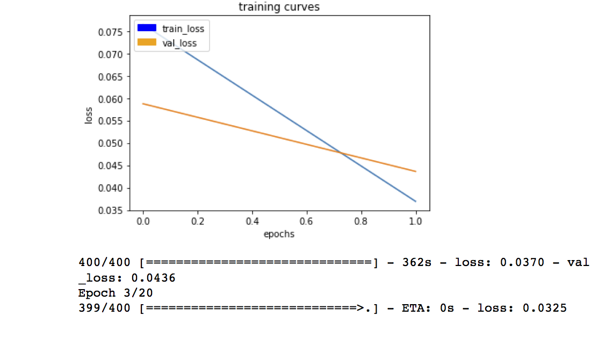
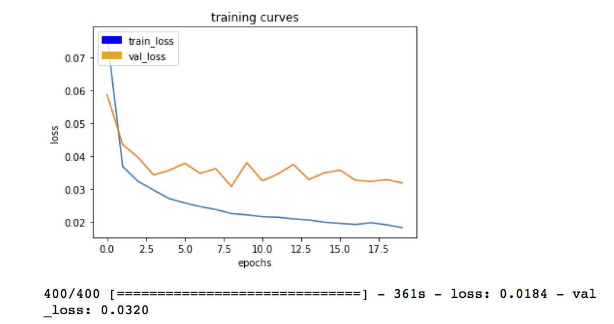

## Deep Learning Project ##

This project implements a fully convolutional deep neural network supporting the semantic segmentation model. Semantic segmentation is superior to bounding boxes as it accurately segments to the actual shape of the object. The DNN learns and later identifies and tracks a target in simulation. This target is called the `hero` throughout this documentation. In this project I:

* Implemented the Fully Convolutional Network (FCN) deep neural network.
* Gathered simulation data, training and validation, with and without hero, using the Unity simulator.
* Trained the model on an Amazon AWS instance.
* Checked the score for accuracy.
* Ran the model in the simulator to follow the hero.

<center>
<table>
    <tr>
        <th>Follow Me Project - Figure 1</th>
    </tr>
    <tr>
        <td>
            
        </td>
    </tr>
</table>
</center>

## Step 1 - Separable Convolutions and Batch Normalization

The Encoder for the FCN requires separable convolution layers, due to their advantages as explained in the classroom. The 1x1 convolution layer in the FCN, is a regular convolution. Each function includes batch normalization with the ReLU activation function applied to the layers. Two function were provided, `separable_conv2d_batchnorm`, profiding a normalized separable 2 dimensional convolution and `conv2d_batchnorm` providing a simple normalized 2 dimensional convolution.

Why batch normalization?

* Networks train faster because convergence is quicker, resulting in overall performance improvement.
* Batch normalization allows higher learning rates, since the normalization helps gradient descent to converge more quickly. 
* Batch normalization adds some noise to the network, but works as well as dropout in improving performance.

Why separable convolution layers?

Separable convolution layers consist of a convolution over each channel of an input layer, followed by a 1x1 convolution taking the output channels from the previous step and then combining them into an output layer. Separable convolution helps by reducing the number of parameters. The reduction in the parameters improves runtime performance. Separable convolution layers also reduce overfitting due to fewer parameters.

## Step 2 - Bilinear Upsampling

The function `bilinear_upsample()` provided implements the bilinear upsampling layer. Bilinear upsampling uses the weighted average of four nearest pixels, diagonal to a given pixel, to estimate a new pixel value. It is used in the decoder block to upsample the input to the larger layer.

## Step 3 - Building the Model 

The steps in building the model are:
* Create an encoder_block
* Create a decoder_block
* Build the FCN consisting of encoder blocks, a 1x1 convolution, and decoder blocks. 

### The Encoder Block

The encoder block includes a separable convolution layer using the `separable_conv2d_batchnorm()` function:

```
def encoder_block(input_layer, filters, strides):
    output_layer = separable_conv2d_batchnorm(input_layer, filters, strides=strides)
    return output_layer
```

### The Decoder Block

The decoder block consists of:
* A bilinear upsampling layer using the `upsample_bilinear()` function.
* Layer concatenation.
* Several separable convolution layers to extract more spatial information from prior layers.

```
def decoder_block(small_ip_layer, large_ip_layer, filters):   
    # Upsample
    sampled = bilinear_upsample(small_ip_layer)
    # Concatenate the upsampled and large input layers using layers.concatenate
    cat = layers.concatenate([sampled, large_ip_layer])
    # Add some number of separable convolution layers
    conv1 = SeparableConv2DKeras(filters=filters,kernel_size=1, strides=1,padding='same', activation='relu')(cat)
    conv2 = SeparableConv2DKeras(filters=filters,kernel_size=1, strides=1,padding='same', activation='relu')(conv1)
    output_layer = SeparableConv2DKeras(filters=filters,kernel_size=1, strides=1,padding='same', activation='relu')(conv2)
    return output_layer
```

### The FCN Model

There are three steps in building the model:
* Encoder blocks to build the encoder layers.
* A 1x1 Convolution layer using the `conv2d_batchnorm()` function, with a kernel_size and stride of 1.
* The same number of decoder blocks for the decoder layers to create to the original image size.

```
def fcn_model(inputs, num_classes):
    # add some number of encode blocks
    layer1 = encoder_block(inputs, 32, strides=2)
    layer2 = encoder_block(layer1, 64, strides=2)
    layer3 = encoder_block(layer2, 64, strides=2)    
    # Add 1x1 Convolution layer using conv2d_batchnorm().
    conv2d_batchnormed = conv2d_batchnorm(layer3, 64, kernel_size=1, strides=1)
    # Add the same number of Decoder Blocks as the number of Encoder Blocks
    layer4 = decoder_block(conv2d_batchnormed, layer2, 64)
    layer5 = decoder_block(layer4, layer1, 64)
    x = decoder_block(layer5, inputs, 32)
    # The function returns the output layer of your model. "x" is the final layer obtained from the last decoder_block()
    return layers.Conv2D(num_classes, 3, activation='softmax', padding='same')(x)
 ```
 
## Training 

The FCN was then trained on sample data with given hyperparameters to compile and train the model. Two of the 20 training curves are shown for brevity:

<p align="center">
<table>
    <tr>
        <th>Epoch 2</th><th>Epoch 20</th>
    </tr>
    <tr>
        <td>
            
        </td>
        <td>
            
        </td>
    </tr>
</table>
</p>


## Prediction 

Now that you have your model trained and saved, you can make predictions on your validation dataset. These predictions can be compared to the mask images, which are the ground truth labels, to evaluate how well your model is doing under different conditions.
There are three different predictions available from the helper code provided:
patrol_with_targ: Test how well the network can detect the hero from a distance.
patrol_non_targ: Test how often the network makes a mistake and identifies the wrong person as the target.
following_images: Test how well the network can identify the target while following them.


The write-up / README should include a statement and supporting figures / images that explain how each rubric item was addressed, and specifically where in the code each step was handled. The write-up should include a discussion of what worked, what didn't and how the project implementation could be improved going forward.

This report should be written with a technical emphasis (i.e. concrete, supporting information and no 'hand-waiving'). Specifications are met if a reader would be able to replicate what you have done based on what was submitted in the report. This means all network architecture should be explained, parameters should be explicitly stated with factual justifications, and plots / graphs are used where possible to further enhance understanding. A discussion on potential improvements to the project submission should also be included for future enhancements to the network / parameters that could be used to increase accuracy, efficiency, etc. It is not required to make such enhancements, but these enhancements should be explicitly stated in its own section titled "Future Enhancements".

The write-up conveys the an understanding of the network architecture.

The student clearly explains each layer of the network architecture and the role that it plays in the overall network. The student can demonstrate the benefits and/or drawbacks different network architectures pertaining to this project and can justify the current network with factual data. Any choice of configurable parameters should also be explained in the network architecture.

The student shall also provide a graph, table, diagram, illustration or figure for the overall network to serve as a reference for the reviewer.

The write-up conveys the student's understanding of the parameters chosen for the the neural network.

The student explains their neural network parameters including the values selected and how these values were obtained (i.e. how was hyper tuning performed? Brute force, etc.) Hyper parameters include, but are not limited to:

### Hyperparameters

The hyperparameters are:

* `batch_size`: number of training samples/images that get propagated through the network in a single pass.
* `num_epochs`: number of times the entire training dataset gets propagated through the network.
* `steps_per_epoch`: number of batches of training images that go through the network in 1 epoch.
* `validation_steps`: number of batches of validation images that go through the network in 1 epoch.
* `workers`: maximum number of processes.

The following hyperparameters were used:

```
learning_rate = 0.005
batch_size = 64
num_epochs = 20
steps_per_epoch = 400
validation_steps = 50
workers = 2
```

I found that at least 20 epochs were required to acheive the accuracy required. I ran the model on an AWS instance for speed. A large number of steps per epoch was key to getting a better score. The learning rate is quite low, made possible by the nomralization steps. Higher learning rates caused the model to diverge as the epochs proceeded.

All configurable parameters should be explicitly stated and justified.

The student has a clear understanding and is able to identify the use of various techniques and concepts in network layers indicated by the write-up.

The student is demonstrates a clear understanding of 1 by 1 convolutions and where/when/how it should be used.

The student demonstrates a clear understanding of a fully connected layer and where/when/how it should be used.

The student has a clear understanding of image manipulation in the context of the project indicated by the write-up.

The student is able to identify the use of various reasons for encoding / decoding images, when it should be used, why it is useful, and any problems that may arise.

The student displays a solid understanding of the limitations to the neural network with the given data chosen for various follow-me scenarios which are conveyed in the write-up.

The student is able to clearly articulate whether this model and data would work well for following another object (dog, cat, car, etc.) instead of a human and if not, what changes would be required.

## Running the Model in the Simulator

<center>
<table>
    <tr>
        <th>Following The Hero (Click to view)</th>
    </tr>
    <tr>
        <td>
            <a href="http://douglasteeple.com/DNN/ScreenRecording2.mp4" target=_blank></a>
        </td>
    </tr>
</table>
</center>

## Model

The model is submitted in hdf5 format (.h5) in the git repository.

The neural network obtained an accuracy greater than or equal to 40% (0.40) using the Intersection over Union (IoU) metric. 
The final IoU was 0.553580020823. 
The final score was 0.407318352164
The required final score was met.

